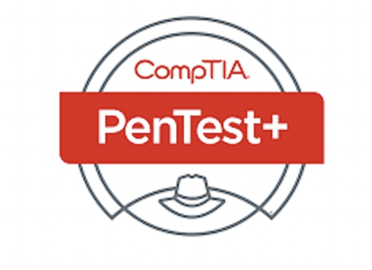

## PenTest+ - Certification Exam Prep

### Overview
The CompTIA Pentest+ exam is a globally recognized certification that validates the skills and knowledge required for professionals aiming to perform penetration testing and vulnerability assessment. 

This intermediate-level certification assesses candidates' abilities in planning, scoping, executing, analyzing, and reporting on penetration tests, emphasizing both white-box and black-box methodologies. 

  

Covering various domains such as planning and scoping, information gathering, vulnerability identification, attacks and exploits, penetration testing tools, and reporting, the Pentest+ exam evaluates individuals' understanding of the most current penetration testing techniques, tools, and best practices within diverse IT environments, making it an essential certification for those pursuing careers in cybersecurity and ethical hacking.

### Define Scope of Engagement
---
- [Scoping and Engagement](./ScopingandEngagement/)
- [Passive Reconnaissance](./PassiveReconnaissance)